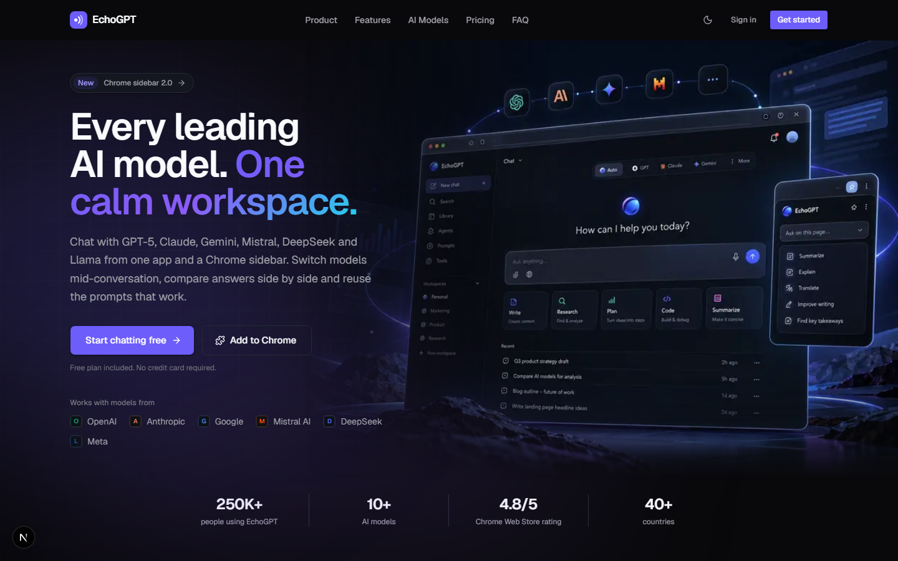
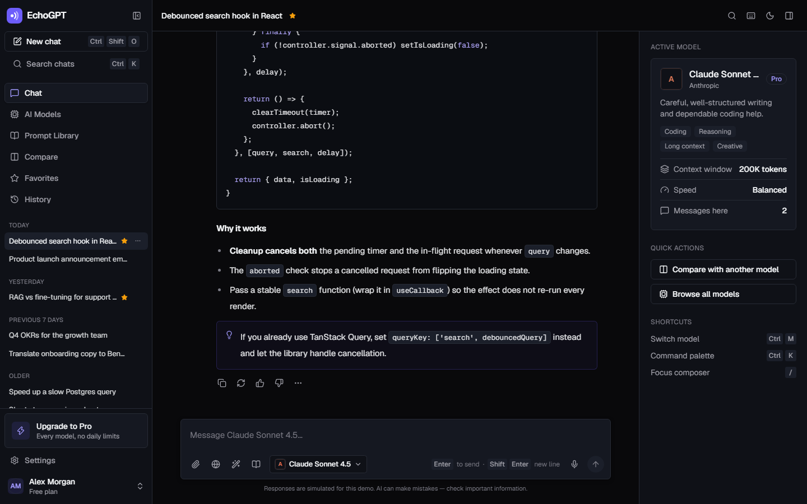
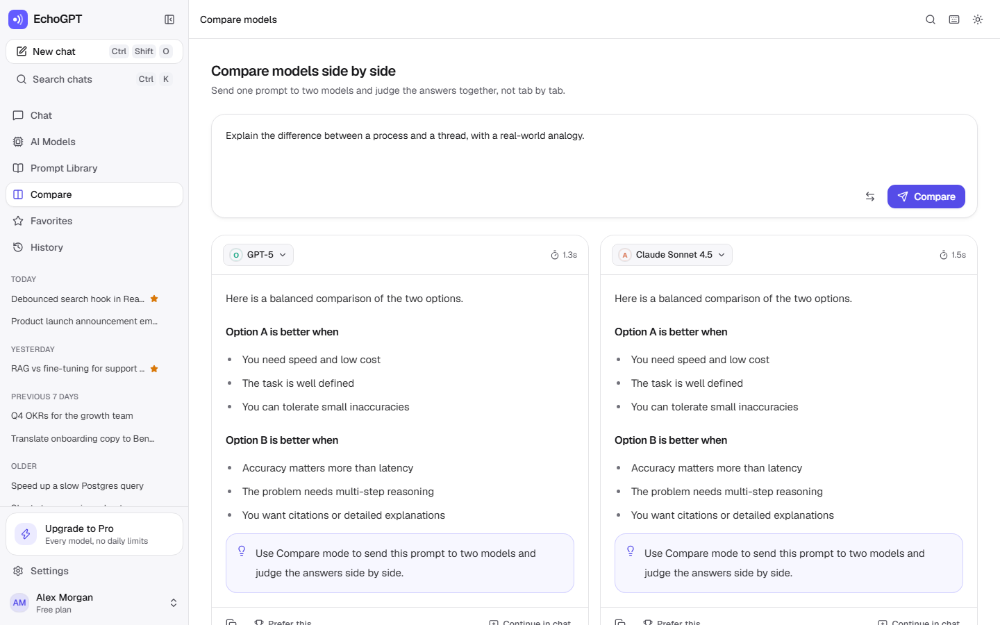
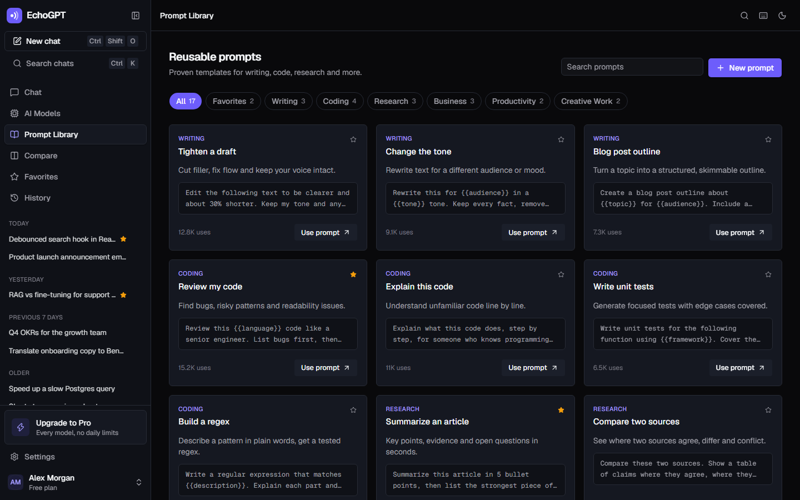
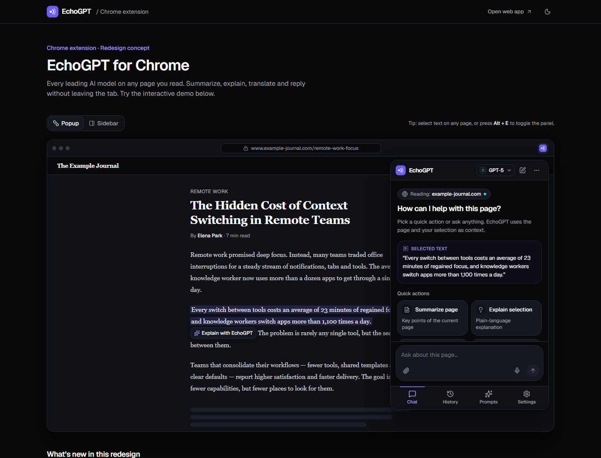
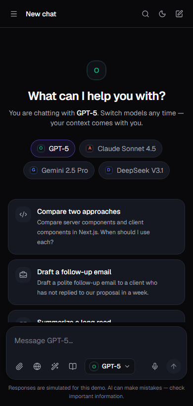

# EchoGPT — Frontend Redesign Concept

A redesign of the **EchoGPT** ecosystem built for the **AppifyDevs Software Engineering Internship (Frontend) technical assignment**. It is a frontend concept: there is no backend, and every AI response is simulated locally so the interface can be explored end to end.

The project brings three experiences together under one design system:

| Route                  | Experience                                                                     |
| ---------------------- | ------------------------------------------------------------------------------ |
| `/`                    | Marketing landing page                                                         |
| `/app`                 | Redesigned web application (chat, models, prompts, compare, history, settings) |
| `/extension`           | Interactive Chrome extension demo (popup and sidebar layouts)                  |
| `/sign-in`, `/sign-up` | Mock authentication pages with validated forms                                 |

> Live demo: _add your Vercel URL here after deploying_ · Current product for reference: [echogpt.live](https://echogpt.live/)

---

## Screenshots

| Landing page                                  | Web app                              |
| --------------------------------------------- | ------------------------------------ |
|  |  |

| Compare models (light theme)                    | Prompt library                                  |
| ----------------------------------------------- | ----------------------------------------------- |
|  |  |

| Chrome extension demo                               | Mobile                                 |
| --------------------------------------------------- | -------------------------------------- |
|  |  |

---

## Tech stack

| Area       | Choice                                                                  |
| ---------- | ----------------------------------------------------------------------- |
| Framework  | Next.js 16 (App Router, Turbopack), React 19, TypeScript (strict)       |
| Styling    | Tailwind CSS v4 with CSS-variable design tokens                         |
| Components | shadcn/ui (Radix primitives), cmdk for command menus, Sonner for toasts |
| Motion     | Motion (`motion/react`) with `LazyMotion`, loaded asynchronously        |
| Icons      | Lucide React                                                            |
| Forms      | React Hook Form + Zod                                                   |
| State      | Zustand (with `persist` for localStorage)                               |
| Fonts      | Geist Sans / Geist Mono via `next/font`                                 |
| Testing    | Vitest + Testing Library (unit/component), Playwright (end-to-end)      |
| Tooling    | ESLint (`eslint-config-next`), Prettier with the Tailwind plugin        |

**TanStack Query was deliberately not added.** The only asynchronous work is a local mock completion function, and its loading, error and cancel states live next to the chat state in Zustand. With a real API, TanStack Query would be the natural addition for server data such as conversation history.

---

## Getting started

Requirements: Node.js 20.9+ (developed on Node 24) and npm.

```bash
npm install
npm run dev          # http://localhost:3000
```

| Command             | What it does                                    |
| ------------------- | ----------------------------------------------- |
| `npm run dev`       | Start the development server                    |
| `npm run build`     | Production build                                |
| `npm start`         | Serve the production build                      |
| `npm run lint`      | ESLint                                          |
| `npm run typecheck` | TypeScript (`tsc --noEmit`)                     |
| `npm test`          | Unit and component tests (Vitest)               |
| `npm run test:e2e`  | End-to-end tests (Playwright, desktop + mobile) |
| `npm run format`    | Format with Prettier                            |

The first time you run the end-to-end tests, install a browser with `npx playwright install chromium`. The config reuses a running dev server or starts one.

Optional environment variable: `NEXT_PUBLIC_SITE_URL` sets the canonical URL for metadata, the sitemap and robots.txt.

---

## Features

### Landing page (`/`)

- Sticky header. On scroll it gains a border and blur. It highlights the active section, and on mobile the menu is a drawer.
- Hero with the core message ("Every leading AI model. One calm workspace."), a primary and a secondary CTA, provider marks and trust figures. The hero animates in with CSS only, so it doesn't wait for JavaScript.
- A theme-matched product banner (`public/hero-banner-dark.png` / `hero-banner-light.png`) served through `next/image`.
  - On wide screens (1280px+) it fills the right side behind the copy and fades into the page; on smaller screens it sits below the text.
  - Both images are lazy and the inactive one is `display: none`, so only the banner for the current theme is downloaded, with a blur placeholder while it loads.
- **Features**: three key capabilities (multi-model chat, model switching and the browser sidebar) get full-width rows with small product fragments. Prompt workflows, organization, shortcuts and reusable prompts are listed below them without boxes.
- **AI Models**: a data-driven, table-style list showing each model's provider, strengths, context window and Free/Pro plan. On mobile each row stacks.
- **Product preview** tabs: Compare, Prompt library and Chrome sidebar.
- **Why EchoGPT**: benefits with metrics.
- **Workflow comparison**: a real `<table>` on desktop that becomes stacked cards on mobile.
- **Pricing**: Free, Pro and Team plans with a Monthly/Yearly toggle, driven by `data/pricing.ts`.
- **Testimonials**, an accessible **FAQ** accordion and a closing **CTA**.
- **Footer** with link columns, social links and a newsletter form. The form validates with Zod, is a mock that sends nothing, and is lazy-loaded.
- SEO: metadata, Open Graph and Twitter tags, a generated OG image, `sitemap.xml` and `robots.txt`.

### Sign in and sign up (`/sign-in`, `/sign-up`)

- The header's "Sign in" and "Get started" open these pages.
- Split layout: the form on the left and the theme banner on the right (large screens).
- React Hook Form + Zod validation with inline errors, a password show/hide toggle, and Google/GitHub buttons (simulated).
- Submitting shows a loading state, then opens the workspace. Sign-up saves the name and email as the profile shown in the app's account menu.

### Web app (`/app`)

- **Layout**
  - The desktop sidebar collapses to an icon rail (<kbd>⌘/Ctrl B</kbd>) and remembers its state. On mobile it becomes a drawer.
  - Top bar shows the page or conversation title, with a favorite toggle.
  - A details panel on large screens shows the active model and shortcuts; it can be toggled.
- **Chat**
  - Empty state with a model quick-pick and suggested prompts.
  - Messages are structured: headings, paragraphs, lists, code blocks with syntax colors and copy, and callouts.
  - Actions on each reply: copy, regenerate, thumbs up/down, a share link (simulated) and "Compare with another model".
  - A typing state while the model "thinks", a stop button, a scroll-to-latest button, animated message entry, and an error state with retry. Include "simulate error" in a prompt to see it.
- **Composer**
  - Auto-resizing textarea. <kbd>Enter</kbd> sends and <kbd>Shift Enter</kbd> adds a new line; this is configurable in settings.
  - Send is disabled while the prompt is empty.
  - Tools: file attachments (chips with name and size; files are not uploaded), a web-search toggle (simulated), "Improve prompt", insert a saved prompt, and a voice button marked as coming soon.
  - A searchable model selector (<kbd>⌘/Ctrl M</kbd>) shows logo, provider, tier and capability tags.
- **AI Models**: a catalog with search and capability filters. From each card you can "Chat with…" or set it as the default model.
- **Prompt Library**
  - Six categories, search, and favorites.
  - Create your own prompts through a validated form.
  - Templates with `{{variables}}` open a fill-in dialog with a live preview before opening in chat.
- **Compare**: sends one prompt to two models in parallel and shows the answers side by side (stacked on mobile). Each column has its own loading and error state, a response time, "Prefer this" and "Continue in chat".
- **History**: search across titles and message bodies, filters for model and tag and favorites only, groups by date, and "clear all" with a confirmation step.
- **Favorites**: favorite conversations and favorite prompts, on separate tabs.
- **Command palette** (<kbd>⌘/Ctrl K</kbd>) for actions, recent conversations, switching models, navigation and theme. A conversation search dialog and a keyboard-shortcuts dialog (<kbd>⌘/Ctrl /</kbd>) sit alongside it.
- **Settings** has six sections, and each one can be opened directly with `?section=`:
  - General: a profile form with validation.
  - Appearance: theme, message text size and message spacing, with a live preview.
  - AI preferences: default model, response length, send-with-Enter, suggestions, and custom instructions.
  - Notifications.
  - Privacy: turning off "save history" really stops conversations being saved. You can also export conversations as JSON or delete them all.
  - Keyboard shortcuts.
- An upgrade dialog with plan selection. Checkout is simulated, and the pricing CTAs deep-link to it via `/app?upgrade=pro`.

### Chrome extension demo (`/extension`)

- A mock article inside a browser frame. The extension can run in two layouts:
  - **Popup** (380 × 600), toggled from the toolbar icon.
  - **Docked sidebar**, where the page reflows beside it.
  - <kbd>Alt E</kbd> toggles the panel.
- A header with branding, a compact model selector (with feedback when you switch models), new chat and an overflow menu.
- A bottom tab bar for **Chat, History, Prompts and Settings**. It's a proper tablist with arrow-key navigation, and the active indicator animates.
- **Chat**: page-context chip, highlighted selected text, and six **quick actions**: Summarize page, Explain selection, Rewrite text, Translate, Generate reply and Ask about page. It also has loading, active and error states.
- **History**: live search with a no-results state, groups by date, and delete with confirmation.
- **Prompts**: browser-focused templates that fill in `{{text}}` from the page selection. Favorites are shared with the web app.
- **Settings**:
  - Theme, default model, response length and behaviour toggles.
  - A translation preferences form with validation.
  - A shortcut list.
  - Privacy options, including clearing history.
- Below 768px the demo shows the extension panel on its own at full width.

---

## Architecture

```
app/                      Routes (Server Components by default)
  page.tsx                Landing page
  app/                    Web app: layout + chat, models, prompts, compare, favorites, history, settings
  extension/              Chrome extension demo
  opengraph-image.tsx, robots.ts, sitemap.ts, icon.svg, not-found.tsx
components/
  ui/                     shadcn/ui primitives (lightly customized)
  shared/                 Cross-surface building blocks: Logo, ModelIcon, ThemeToggle, SegmentedControl,
                          FilterChips, TooltipIconButton, CopyButton, ConfirmDialog, BrowserFrame,
                          Reveal/Stagger, EmptyState/ErrorState/LoadingState/SkeletonLoader, ResponsiveContainer
  landing/                Landing page sections
  app/                    App shell: sidebar, header, command palette, dialogs, utility panel
  extension/              Extension shell, navigation, views and demo frame
features/                 Feature modules (components + hooks + pure logic)
  chat/                   ChatWorkspace, ChatComposer, ChatMessage, MessageContent, mock responder, parsers
  models/                 ModelSelector, ModelCatalog
  prompts/                PromptCard, PromptLibrary, dialogs, template utilities
  compare/                Side-by-side comparison
  history/                History & favorites views, conversation search
  settings/               Settings sections
hooks/                    Generic hooks (hotkeys, media query, clipboard, auto-resize, store hydration)
store/                    Zustand stores: chat, preferences, prompts, UI, theme, extension
data/                     Mock data: models, prompts, conversations, pricing, features, FAQ, testimonials…
schemas/                  Zod schemas for forms
types/                    Shared TypeScript types (models, chat, prompts, marketing, settings, extension)
constants/                Site config, navigation, storage keys, keyboard shortcuts
providers/                Root providers and store hydration
tests/                    unit/ (Vitest) and e2e/ (Playwright)
```

**Data flow.**

- Components read mock data from `data/` and state from `store/`.
- Asynchronous "AI" work goes through `features/chat/lib/mock-responder.ts` (`requestCompletion`), which takes an `AbortSignal` and returns structured `MessageBlock[]`.
- To connect a real model gateway, replace that one function. The stores, loading/error/cancel states and UI don't change.

**Types.**

- Messages are a discriminated union (`UserMessage | AssistantMessage`), as are message content blocks.
- Compare results are a discriminated union of `idle | loading | success | error`.
- No `any` is used.

---

## Design decisions

- **Dark-first, neutral surfaces, controlled accent.**
  - Tokens follow the provided palette: `#09090B` page → `#0F1117` section → `#151821` card → `#1B1F2A` hover, with `#6D5DFB` as the primary.
  - Roughly 85% of the interface is neutral. The violet is reserved for primary actions, selection, focus and active states. Cyan appears only in tiny "new" indicators.
- **Semantic tokens only.**
  - Components use classes such as `bg-card`, `text-muted-foreground` and `text-primary-text`, never raw hex values.
  - The light theme redefines the same tokens.
  - A separate `--primary-text` token keeps brand-colored _text_ readable on neutral surfaces in both themes.
- **Provider colors stay small.** Each provider's color only tints its monogram tile, so model entries look consistent and EchoGPT's brand stays dominant.
- **Few cards, small radius.** The landing page uses rows, tables, hairline dividers and plain columns instead of a grid of boxes; cards are kept only where grouping helps (pricing plans, app panels). The base radius is 6px (`--radius: 0.375rem`), and cards, inputs and buttons share it for one crisp, consistent corner.
- **Readable chat.**
  - Assistant replies sit directly on the page surface, and user messages use a subtle brand tint instead of bright bubbles.
  - Code blocks use a dedicated dark surface in both themes.
- **One primary action per area.** For example: "Start chatting free" next to an outline "Add to Chrome", or a single highlighted CTA on the Pro pricing card.
- **Structured responses instead of a markdown library.** Mock answers are typed blocks rendered by `MessageContent`, which has a tiny inline parser and highlighter. This keeps the bundle small and the content typed.

---

## Accessibility

- Semantic landmarks (`header`, `nav`, `main`, `aside`, `footer`), one `h1` per page, and skip links.
- Everything is keyboard-operable:
  - Radix primitives handle dialogs, menus, popovers, the accordion, tabs and radio groups.
  - cmdk handles the command menus.
  - The extension tab bar supports arrow keys, Home and End.
- Focus rings are visible in both themes.
- Icon-only buttons have accessible names and matching tooltips.
- Form fields are labelled, errors use `role="alert"`, and invalid fields set `aria-invalid`.
- Status is never shown by color alone: favorites use a star icon plus a label, the comparison table uses icons plus screen-reader text, and errors have titles.
- Contrast targets WCAG AA. The dark tertiary text color was lifted from `#71717A` to `#7C7C86` so it passes on `#09090B`.
- Reduced motion is respected: Motion uses `reducedMotion="user"`, and a global CSS rule shortens CSS animations and transitions.
- Live regions announce new messages, copy confirmations and loading states.

## Performance

- Server Components by default. The landing page is mostly server-rendered, with small client islands: header state, mobile menu, pricing toggle, preview tabs and the accordion.
- The Motion animation engine loads asynchronously through `LazyMotion` and uses the lightweight `m` components.
- The command palette, search, shortcut and upgrade dialogs are loaded with `next/dynamic` the first time they open.
- The newsletter form (React Hook Form + Zod) loads only as the footer approaches the viewport.
- Workspace stores aren't imported on the landing page. The theme is applied by a tiny inline script before first paint, so there is no flash.
- Zod is imported as `import * as z` so unused parts (such as its locale bundles) are tree-shaken. That change alone cut about 290 KB (raw) from the shared chunk.
- Every route is statically prerendered (`○ Static` in the build output).
- Measured on a local production build:
  - Landing page: about 300 KB gzipped initial JS, of which about 155 KB is the Next.js and React runtime.
  - Largest Contentful Paint: under 200 ms locally.

## Testing

- **Unit and component tests** (`tests/unit`, 32 tests), covering:
  - the inline markdown parser and plain-text export;
  - the mock responder (intent detection, titles, response styles, provider voices, errors, cancellation);
  - prompt template utilities;
  - conversation search and date grouping;
  - the chat store (send, reply, stop, favorite, delete);
  - the `ChatComposer` component (disabled send, Enter vs Shift+Enter, Ctrl/⌘+Enter mode).
- **End-to-end tests** (`tests/e2e`, desktop and mobile):
  - the landing CTA leads into the app;
  - choosing a model, sending a prompt, seeing the thinking state and receiving a mock response;
  - header "Sign in" opens the sign-in page, validation errors appear, and a valid submit opens the app;
  - sign-up saves the entered name, which then appears in the workspace account menu.

---

## Assumptions

- The assignment asks for a frontend redesign, so there is no authentication, database or model API. The signed-in user, conversations, prompts, testimonials, statistics and prices are realistic placeholder data.
- Model names reflect providers EchoGPT supports today (OpenAI, Anthropic, Google, Mistral, DeepSeek, Meta). The catalog is illustrative and lives in `data/models.ts`.
- Provider marks are neutral monogram tiles rather than official logos, to avoid using trademarked assets.
- "Add to Chrome" links to the interactive `/extension` demo instead of the Chrome Web Store. The real store URL is in `constants/site.ts`.

## Known limitations

- AI responses come from templates chosen by keywords in the prompt, so they are not real answers to arbitrary questions. Responses appear after a short delay rather than streaming token by token.
- These controls are simulated and say so in the interface: attachments (files are listed, not uploaded), web search, voice input, share links and checkout.
- Authentication is a mock: any valid email and password (or the Google/GitHub buttons) signs you in and opens `/app`, and "Forgot password?" only shows a notice. Sign-up stores the name and email as the local profile; sign-out returns to `/sign-in`. The workspace is not protected by a login.
- Custom instructions (in both the app and the extension) are validated and saved, but the mock responder does not use them.
- Data persists only in this browser's localStorage. Clearing site data resets the demo.
- The extension is a web demo of the UI, not an installable Manifest V3 extension. Its shortcuts are display-only, except <kbd>Alt E</kbd>, which toggles the panel.

## Future improvements

- Connect a real model gateway with streaming responses (Server-Sent Events or the Vercel AI SDK) and use TanStack Query for conversation history.
- Authentication, cloud sync and shared team workspaces.
- Package the extension UI as a real Manifest V3 extension that shares these components.
- Server-side syntax highlighting (for example Shiki) and full markdown rendering for real model output.
- Visual regression tests and automated accessibility checks (axe) in CI.

## Deployment

The app is fully static-friendly and deploys to Vercel with no configuration:

1. Push the repository to GitHub.
2. Import it at [vercel.com/new](https://vercel.com/new). The framework preset (Next.js) is detected automatically.
3. Optionally set `NEXT_PUBLIC_SITE_URL` to the production URL so canonical links, Open Graph tags and the sitemap use it.

Any Node host works too: run `npm run build`, then `npm start`.

---

_Built as a frontend redesign concept for the EchoGPT / AppifyDevs technical assignment. It is not affiliated with or endorsed by the providers of the AI models mentioned._
